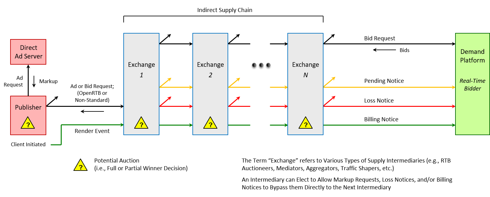
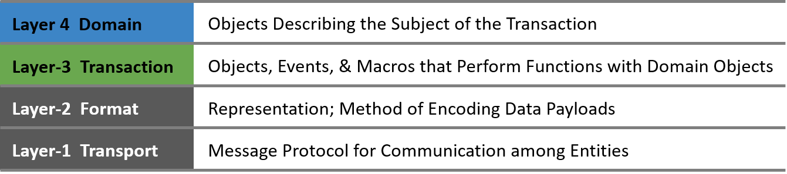
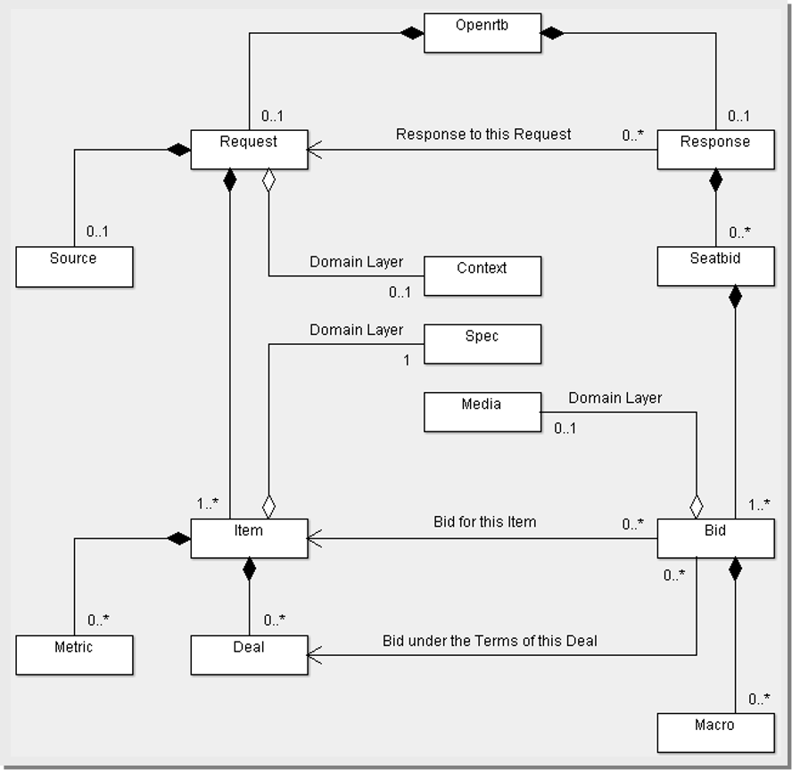

# OpenRTB Спецификация v3.0

**Март 2022**

**О IAB Technology Lab**

Технологическая лаборатория IAB - это некоммерческий консорциум, занимающийся исследованиями и разработками.
на разработку и помощь компаниям во внедрении глобальных отраслевых технических стандартов и
решения. Цель Лаборатории технологий - уменьшить трение, связанное с цепочкой поставок цифровой рекламы
и маркетинговой цепочке поставок, способствуя при этом безопасному развитию отрасли.
Технологическая лаборатория IAB возглавляет разработку технических стандартов, создает и поддерживает
библиотеку кодов для быстрого и экономически эффективного внедрения стандартов IAB, а также создает тестовую платформу для компаний, чтобы они могли оценить совместимость.
тестовую платформу для компаний, позволяющую оценить совместимость их технологических решений со стандартами IAB
стандартами IAB, которые на протяжении 18 лет являются основой для совместимости и прибыльного роста
в цепочке поставок цифровой рекламы.

Подробнее о IAB Tech Lab at [www.iabtechlab.com](https://www.iabtechlab.com).

**Лицензия**

Лицензия OpenRTB Specification the IAB Tech Lab распространяется на условиях Creative Commons Attribution 3.0 License. Чтобы ознакомиться с копией этой лицензии, посетите[creativecommons.org/licenses/by/3.0/](http://creativecommons.org/licenses/by/3.0/) или напишите в Creative Commons, 171 Second Street, Suite 300, San Francisco, CA 94105, USA.


**TABLE OF CONTENTS**

- [ОБЗОР](#overview)
  - [Миссия OpenMedia](#openmediamission)
  - [OpenRTB Executive Summary](#execsummary)
  - [История OpenRTB](#historyofopenrtb)
- [НОРМАТИВНЫЕ УКАЗАНИЯ](#guidance)
- [АРХИТЕКТУРА](#architecture)
  - [Принципы OpenRTB](#openrtb_principles)
  - [Терминология](#terminology)
  - [Reference Model](#referencemodel)
  - [Уровни протокола](#protocollayers)
    - [Уровень-1:  Транспортный](#layer1_transport)
      - [Communications](#communications)
      - [Version Headers](#versionheaders)
      - [Transport Security](#transportsecurity)
    - [Уровень-2:  Формат](#layer2_format)
      - [Представление](#representation)
      - [Кодировка](#encoding)
    - [Уровень-3:  Транзакционный](#layer3_transaction)
    - [Уровень-4:  Доменный](#layer4_domain)
- [СПЕЦИФИКАЦИЯ](#specification)
  - [Объект Model](#objectmodel)
    - [Объект:  Openrtb](#object_openrtb)
  - [Bid Request Payload](#bidrequestpayload)
    - [Объект:  Request](#object_request)
    - [Объект:  Source](#object_source)
    - [Объект:  Item](#object_item)
    - [Объект:  Deal](#object_deal)
    - [Объект:  Metric](#object_metric)
  - [Bid Response Payload](#bidresponsepayload)
    - [Объект:  Response](#object_response)
    - [Объект:  Seatbid](#object_seatbid)
    - [Объект:  Bid](#object_bid)
    - [Объект:  Macro](#object_macro)
  - [Substitution Macros](#substitutionmacros)
  - [Event Notification](#eventnotification)
    - [Объект:  Pending](#event_pending)
    - [Объект:  Billing](#event_billing)
    - [Объект:  Loss](#event_loss)
    - [Complex Event Chains](#complexeventchains)
  - [Inventory Authentication](#inventoryauthentication)
    - [Ads.cert Primer](#adscertprimer)
    - [Detailed Implementation Guide](#detailedimplementationguide)
  - [Enumerations](#enumerations)
    - [Список:  No-Bid Reason Codes](#list_nobidreasoncodes)
    - [Список:  Loss Reason Codes](#list_lossreasoncodes)
- [ПРИМЕРЫ](#examples)
  - [Bid Request](#bidrequest)
  - [Bid Response](#bidresponse)
- [Приложение A:  Дополнительные ресурсы](#appendixa_additionalresources)
- [Приложение B:  Журнал изменений](#appendixb_changelog)
- [Приложение C:  Errata](#appendixc_errata)
- [Приложение C:  Политика версионирования](#appendixd_versioning)


# ОБЗОР <a name="overview"></a>

## Миссия OpenMedia <a name="openmediamission"></a>

Миссия проекта OpenMedia заключается в стимулировании роста программных площадок путем предоставления открытых отраслевых стандартов для связи между покупателями рекламы и продавцами инвентаря издателей. Существует несколько аспектов этих стандартов, включая, но не ограничиваясь ими, протокол торгов в реальном времени, таксономии информации, синхронизацию оффлайн-конфигураций и многое другое.

## OpenRTB Executive Summary <a name="execsummary"></a>

Этот документ определяет стандарт для интерфейса торгов в реальном времени (RTB). Этот стандарт протокола направлен на упрощение связи между поставщиками инвентаря издателей (т. е. биржами, сетями, работающими с издателями, и платформами, работающими со стороной предложения) и конкурентоспособными покупателями этого инвентаря (т. е. участниками торгов, платформами, работающими со стороной спроса, или сетями, работающими с рекламодателями).

Общей целью OpenRTB было и остается создание *лингва франка* для общения между покупателями и продавцами. Цель не в том, чтобы регулировать то, как именно каждая сторона ведет бизнес. Как проект, мы стремимся упростить интеграцию между участниками экосистемы, чтобы инновации могли происходить на более глубоком уровне, чем трубы.

## История OpenRTB <a name="historyofopenrtb"></a>

OpenRTB был запущен как пилотный проект между тремя платформами, ориентированными на спрос (dataxu, MediaMath и Turn), и тремя платформами, ориентированными на продажу (Admeld, PubMatic и The Rubicon Project), в ноябре 2010 года. Первой целью была стандартизация взаимодействия между сторонами для обмена списками блоков. Версия v1.0 спецификации блокчейна OpenRTB была выпущена в декабре 2010 года.

Получив положительный ответ от индустрии, компания Nexage обратилась к проекту OpenRTB с предложением создать спецификацию API для OpenRTB, сфокусированную на фактическом протоколе запроса/ответа на предложение в реальном времени и специально для поддержки мобильной рекламы. Мобильный подкомитет был сформирован между компаниями, представляющими buy-side (dataxu, Fiksu и [X+1]), и компаниями, представляющими sell-side (Nexage, Pubmatic, Smaato и Jumptap). Результатом этого проекта стала спецификация OpenRTB v1.0 Mobile, которая была выпущена в феврале 2011 года.

После выпуска спецификации для мобильных устройств был создан подкомитет по видео, в который вошли биржи видеорекламы (BrightRoll и Adap.tv), сотрудничающие с dataxu и ContextWeb для включения поддержки видео. Цель заключалась в том, чтобы включить поддержку отображения, видео и мобильных устройств в один документ. Результатом этих усилий стал OpenRTB v2.0, который был выпущен как единый стандарт в июне 2011 года.

Благодаря широкому распространению в отрасли, OpenRTB был утвержден в качестве стандарта IAB в январе 2012 года с выпуском версии v2.1. Контроль над техническим содержанием спецификации остался за сообществом OpenRTB и его правилами управления.

За прошедшие годы программная реклама стала доминирующей силой в отрасли. Однако это также привело к усложнению цепочки поставок, что может привести к росту мошенничества и других рисков. Это один из ключевых мотивов, побудивших OpenRTB v3.0.

# НОРМАТИВНЫЕ УКАЗАНИЯ <a name="guidance"></a>

Внедрения OpenRTB должны будут обеспечить соответствие каждой транзакции всем применимым региональным законам.

# АРХИТЕКТУРА <a name="architecture"></a>

В этом разделе описывается базовая модель экосистемы, к которой относятся транзакции RTB, и общая организация OpenRTB, чтобы детали спецификации имели надлежащий контекст.

## Принципы OpenRTB <a name="openrtb_principles"></a>

Ниже описаны руководящие принципы, лежащие в основе спецификации OpenRTB, некоторые из ее основных правил и ее развитие.

* OpenRTB - это живая спецификация. Новые объекты и атрибуты могут быть добавлены, а перечислимые списки могут быть расширены в любое время, и поэтому реализаторы должны принимать эти типы изменений без сбоев в пределах номера версии. Смотрите [Приложение D: Версионирования политика](#appendixd_versioning)
  * Например, источник требований имеет реализацию "OpenRTB 3.0", но должен допускать новые поля или значения перечисляемых списков, которых он не ожидает, например, из более нового выпуска OpenRTB 3.0.
  * Аналогичным образом, источники поставки должны свободно передавать новые поля или значения перечислений (например, из новой версии) и должны допускать ответы на заявку с новыми полями и значениями перечислений, которых они не ожидают.

* Имена объектов и атрибутов намеренно сделаны компактными, но при этом стараются сохранить удобочитаемость. Причина в том, что эти имена могут очень часто передаваться открытым текстом.

* OpenRTB не навязывает никакого конкретного представления для своих объектов. По умолчанию используется представление JSON, но могут использоваться и другие. Смотрите [Представительство](#representation).

* Все объекты OpenRTB могут быть расширены по мере необходимости для специфических приложений производителя. Поля расширения для объекта OpenRTB всегда должны быть помещены в подчиненный объект "ext". Большинство перечисляемых списков, если они указаны, также могут быть расширены для включения кодов конкретного поставщика, обычно начинающихся с 500.

## Терминология <a name="terminology"></a>

Следующие термины используются в данном документе именно в контексте OpenRTB и данной спецификации.

<table>
  <tr>
    <td><strong>Термин</strong></td>
    <td><strong>Определение</strong></td>
  </tr>
  <tr>
    <td>RTB</td>
    <td>Торги за отдельные предметы в режиме реального времени или почти в режиме реального времени.</td>
  </tr>
  <tr>
    <td>Supply&nbsp;Source</td>
    <td>Издатель или другой источник аудитории, продающий инвентарь.</td>
  </tr>
  <tr>
    <td>Exchange</td>
    <td>Организация (например, SSP), проводящая аукцион среди участников по каждому предмету.</td>
  </tr>
  <tr>
    <td>Intermediary</td>
    <td>Организация, находящаяся на пути между источниками спроса и предложения (например, биржа).</td>
  </tr>
  <tr>
    <td>Supply&nbsp;Chain</td>
    <td>Набор из 1+ посредников между конечными источниками спроса и предложения.</td>
  </tr>
  <tr>
    <td>Demand&nbsp;Source</td>
    <td>Субъект (например, DSP), который делает ставки на предметы в аукционе.</td>
  </tr>
  <tr>
    <td>Seat</td>
    <td>Организация-покупатель (например, рекламодатель, агентство), которая хочет получить товары и использовать платформу спроса, чтобы действовать от своего имени; обычно это владелец бюджета на покупку.</td>
  </tr>
  <tr>
    <td>Deal</td>
    <td>Соглашение между продавцами и покупателями о покупке товаров на определенных условиях.</td>
  </tr>
</table>


## Модель <a name="referencemodel"></a>

OpenRTB обычно рассматривается как взаимодействие между биржей и ее источниками спроса или, иногда, как аукционист и его участники. В этом ключе OpenRTB определяет метод продажи микротоваров (например, рекламных показов) путем трансляции запросов на ставки от биржи своим партнерам по спросу, сбора заявок в ответ и определения победителя на основе определенных правил аукциона. Биржа может уведомить покупателей о том, что их заявки приняты, а когда заявка становится платной в соответствии с бизнес-политикой биржи (например, с учетом наценки), биржа уведомляет победившего покупателя, предоставляя ему важные данные, такие как клиринговая цена. Другие покупатели могут быть уведомлены о том, что они проиграли аукцион.

Однако современная экосистема гораздо сложнее. Стали чрезвычайно распространены торги заголовками, что приводит к появлению новой точки принятия решения на уровне издателя или агента пользователя или рядом с ним, в результате чего биржа перестает быть единственным решающим звеном. Также стало обычным явлением наличие более чем одного посредника в цепочке поставок; возможно, посредника или биржи, которая использует другую биржу в качестве источника спроса в дополнение к своему собственному, напрямую интегрированному спросу.

Эти структуры изображены на следующей схеме эталонной модели, где биржа может сама выступать в качестве источника спроса, делая ставки на посредника, находящегося выше по течению (слева), и/или использовать другие биржи и DSP, находящиеся ниже по течению (справа), в качестве источников спроса. Обратите внимание, что хотя на рисунке показан общий случай *N* бирж или посредников предложения, практические соображения (например, задержка, последовательное распределение доходов и т. д.) будут иметь тенденцию накладывать естественные ограничения.



Запросы на участие в торгах OpenRTB, ответы на них и события могут быть реализованы между любой парой этих организаций, хотя интеграция издателей, изображенная здесь как издатель - биржа-1, обычно менее стандартизирована. Определенная сущность может знать или не знать о более крупной цепочке поставок, но следует учитывать, что эта цепочка может быть различной для разных издателей. В любом случае, OpenRTB предполагает, что данный объект имеет деловые отношения, по крайней мере в контексте данной транзакции, только со своими непосредственными соседями слева (сторона поставки; вверх по течению) и справа (сторона спроса; вниз по течению).

Последствия этого можно проиллюстрировать на примере распространения событий и сделок на частном рынке. В этой эталонной модели мы говорим от первого лица с точки зрения сущности:

* Я предполагаю, что все события, связанные с ожиданием, выставлением счетов или убытками, которые я получаю, исходят от моего партнера по поставке (т. е. организации, находящейся непосредственно слева от меня) или имеют на это полное право.

* Я отвечаю за отправку событий, связанных с ожиданием, выставлением счетов и потерями, только моим партнерам со стороны спроса (т. е. непосредственно интегрированным организациям, находящимся справа от меня).

* Я выступаю посредником и заключаю сделки между моими партнерами по спросу и предложению (т. е. организациями, находящимися непосредственно слева и справа от меня). Ни одна другая организация не обязана в рамках OpenRTB распространять мои сделки дальше по цепочке.

## Уровни протокола <a name="protocollayers"></a>

Чтобы помочь в повторном использовании объектов в различных спецификациях и позволить различным аспектам спецификации развиваться разными темпами, в OpenRTB v3.0 принят многоуровневый подход. Ниже показана эта модель. Если выражаться неформально, то на Уровне-1 происходит перемещение байтов между сторонами, на Уровне-2 выражается язык этих байтов, на Уровне-3 специфицируется транзакция с использованием этого языка, а на Уровне-4 описывается товар, с которым совершается транзакция.



Учитывая эту многоуровневую концепцию, IAB Tech Lab определила общую организацию соответствующих спецификаций как "Open Media". Ландшафт этих спецификаций и то, как они могут быть организованы в протокольные уровни, иллюстрируется следующим образом.


Следующие подразделы определяют эти уровни применительно к спецификации OpenRTB. Если явно не указано иное, не отмечено как необязательное или не указано как лучшая практика, все существенные аспекты этих подразделов требуются для соответствия OpenRTB.

### Уровень-1:  Транспортный <a name="layer1_transport"></a>

#### Коммуникации <a name="communications"></a>

Базовым протоколом между биржей и ее источниками спроса является HTTP. В частности, для запросов заявок требуется протокол HTTP POST, чтобы обеспечить большую полезную нагрузку, чем HTTP GET, и облегчить использование двоичных представлений. События уведомления могут быть как POST, так и GET по усмотрению биржи.

Вызовы, возвращающие содержимое (например, ответ на ставку), должны возвращать HTTP-код 200. Вызовы, не возвращающие содержимое в ответ на действительные запросы (например, пустой ответ на ставку, который является одним из вариантов указания отсутствия ставки, уведомление о событии), должны возвращать HTTP 204. Недействительные вызовы (например, запрос ставки, содержащий неправильную или поврежденную полезную нагрузку) должны возвращать HTTP 400 с отсутствием содержимого.

#### Заголовки версий <a name="versionheaders"></a>

Версия OpenRTB должна быть передана в заголовке запроса на участие в торгах с помощью пользовательского параметра заголовка. Это позволит организаторам торгов распознать версию содержащегося сообщения до того, как они попытаются разобрать запрос. Смотри [Политика версионирования](#appendixd_versioning) и [Принципы OpenRTB](#openrtb_principles).

`x-openrtb-version: 3.0`

Кроме того, рекомендуется, хотя и необязательно, чтобы ответы включали идентично отформатированный HTTP-заголовок с версией протокола, реализованного ответчиком. Предполагается, однако, что любой ответ будет совместим с версией запроса и что поддержка версии обсуждается сторонами заранее.

**ЛУЧШИЕ ПРАКТИКИ:**  Одним из самых простых и эффективных способов повышения производительности соединений является включение HTTP Persistent Connections, также известного как Keep-Alive. Это оказывает значительное влияние на общую производительность, снижая накладные расходы на управление соединениями, а также загрузку процессора на обеих сторонах интерфейса.

#### Транспортная безопасность <a name="transportsecurity"></a>

Начиная с OpenRTB v3.0, HTTPS и Transport Layer Security (TLS) версии 1.2+ требуются для соответствия, поэтому все соединения, через которые работает протокол OpenRTB, должны быть HTTPS. Устаревшие интеграции, которые по-прежнему используют незащищенный HTTP, больше не считаются соответствующими требованиям.


### Уровень-2:  Формат <a name="layer2_format"></a>

#### *Представление* <a name="representation"></a>

JSON (JavaScript Object Notation) - это формат, используемый по умолчанию для полезной нагрузки данных запроса и ответа на заявку. JSON был выбран за сочетание удобочитаемости и относительной компактности.

Как вариант, биржа может также предлагать двоичные представления (например, сжатый JSON, ProtoBuf, Avro и т. д.), которые могут быть более эффективными с точки зрения времени передачи и пропускной способности. Техническая лаборатория IAB может предложить эталонные реализации для этих или других форматов. Если они доступны, настоятельно рекомендуется использовать эти эталонные реализации IAB, чтобы уменьшить отклонения при интеграции.

Запрос на заявку указывает представление в качестве типа mime с помощью HTTP-заголовка Content-Type. Тип mime для стандартного представления JSON - `application/json`, как показано на рисунке. Формат ответа на заявку должен совпадать с форматом запроса на заявку.

`Content-Type: application/json`

Если используются альтернативные двоичные представления, биржа или SSP должны соответствующим образом указать Content-Type. Например: `avro/binary` или `application/x-protobuf`. Если тип содержимого отсутствует, участник торгов должен считать, что тип `application/json`, если биржа не выбрала другое значение по умолчанию.

#### *Кодировка* <a name="encoding"></a>

Сжатие данных, передаваемых между биржами и источниками спроса, может быть очень полезным. Сжатие значительно уменьшает размер передаваемых данных и, таким образом, экономит пропускную способность сети как для бирж, так и для источников спроса. Чтобы полностью реализовать эту экономию, сжатие должно быть включено как для запроса заявки, отправляемого биржей, так и для ответа на заявку, возвращаемого источником спроса.

Сжатие может быть включено в ответ на заявку с помощью стандартных механизмов HTTP 1.1. Большинство веб-серверов уже поддерживают gzip-сжатие содержимого ответа, поэтому это идеальный выбор. Для того чтобы биржа сообщила о своем желании сжать ответ, ей следует установить стандартный заголовок HTTP 1.1 Accept-Encoding. Используемое значение кодировки должно быть `gzip`.

`Accept-Encoding: gzip`

Этот заголовок указывает источникам спроса на то, что обмен способен принять gzip-кодировку для ответа. Если сервер источника спроса поддерживает эту функцию и правильно настроен, он будет автоматически отвечать с содержимым, закодированным в gzip. Это будет указано с помощью стандартного заголовка HTTP 1.1 Content-Encoding.

`Content-Encoding: gzip`

Чтобы включить сжатие в запросе на покупку, биржа и источник спроса должны сначала договориться о том, что это поддерживается. Это аналогично тому, как если бы использовался пользовательский формат данных, поскольку биржа должна знать и формат, и кодировку перед отправкой запроса на покупку. Если источник спроса поддерживает такую возможность, биржа должна указать, что отправляет запрос на покупку с gzip-сжатием, установив заголовок HTTP 1.1 Content-Encoding. Используемое значение кодировки должно быть `gzip`.

`Content-Encoding: gzip`

Если этот заголовок не задан, считается, что содержимое запроса не закодировано. В HTTP 1.1 заголовок Content-Encoding обычно используется только для содержимого ответа. Однако, используя этот заголовок и для содержимого запроса, мы можем указать, что запрос является сжатым, независимо от используемого формата данных. Это полезно, поскольку даже двоичные форматы данных могут выиграть от сжатия.

### Уровень-3:  Транзакционный <a name="layer3_transaction"></a>

Транзакционный уровень - это сердце протокола торгов в реальном времени, из которого состоит OpenRTB. Он определяет протокол торговли между биржей и ее участниками, или, в более общем случае, посредником в цепи поставок и его интегрированными источниками спроса.

Подробную информацию см. в разделе "Технические характеристики" данного документа.

### Уровень-4:  Доменный <a name="layer4_domain"></a>

Доменный уровень определяет объекты, над которыми работает транзакционный уровень; медиа-биржа, по которой совершается сделка. В типичном рекламном аукционе запрос на покупку будет содержать доменные объекты в двух местах. Во-первых, общий запрос содержит доменные объекты, которые описывают контекст продажи, например сайт или приложение, устройство и пользователя. Во-вторых, каждый предлагаемый к продаже товар будет содержать доменные объекты, определяющие этот товар, такие как детали оттиска и размещения, спецификации и ограничения. Каждая заявка в ответе будет содержать доменные объекты, определяющие носитель, который будет доставлен пользователю в случае победы в аукционе.

Поскольку версия спецификации доменного уровня может меняться независимо от транзакционного уровня, корневой объект транзакционного уровня включает в себя информацию о спецификации и версии домена. Это также очень важно, поскольку поддержка различных версий будет меняться со временем в зависимости от биржи и/или источника спроса.

Для OpenRTB, по умолчанию используется [Advertising Common Object Model (AdCOM)](https://github.com/InteractiveAdvertisingBureau/AdCOM).

# СПЕЦИФИКАЦИЯ <a name="specification"></a>

Этот раздел содержит подробную спецификацию транзакционного уровня OpenRTB. Если явно не указано иное, не отмечено как необязательное или не указано как лучшая практика, все существенные аспекты этого раздела являются обязательными для соответствия OpenRTB.

## Объектная модель <a name="objectmodel"></a>

Следующая диаграмма классов UML иллюстрирует общую структуру полезной нагрузки, включая объекты запроса и ответа. Полезная нагрузка коренится в именованных объектах; `Openrtb` - общий корень, а `Request` и `Response` - подчиненные корни для идентификации типа полезной нагрузки.



Во всех подразделах объектной модели атрибуты могут быть обозначены как "Required" или "Recommended". Атрибуты считаются *required* только в том случае, если их отсутствие нарушит протокол и не обязательно является показателем ценности для бизнеса в противном случае. Атрибуты *recommended*, если их отсутствие не нарушит протокол, но значительно снизит ценность для бизнеса.

С точки зрения соответствия спецификации, любой атрибут, не обозначенный как *required*, является необязательным, независимо от того, рекомендован он или нет. Необязательный атрибут может иметь значение по умолчанию, которое принимается в случае его отсутствия. Если значение по умолчанию не указано, то по условию его отсутствие должно интерпретироваться как *unknown*, если не указано иное. Пустые строки или нулевые значения должны интерпретироваться так же, как и опущенные (т. е. как значение по умолчанию, если оно указано, или как *unknown* в противном случае).

**ЛУЧШИЕ ПРАКТИКИ:**  Биржам и источникам спроса рекомендуется публиковать для своих партнеров набор необязательных объектов и атрибутов, которые они поддерживают, а также любые расширения спецификации.

### Объект:  Openrtb <a name="object_openrtb"></a>

Этот объект верхнего уровня является корневым для полезной нагрузки запроса и ответа. Он содержит информацию о версиях и ссылки на доменную модель Уровня-4, на которой основаны транзакции. По умолчанию доменная модель, используемая OpenRTB, - это Advertising Common Object Model (AdCOM).

Примечание: В соответствии с принятой в данном документе конвенцией, определяемые объекты обозначаются прописной первой буквой в соответствии с общепринятой конвенцией для имен классов в языках программирования, таких как Java, в то время как реальные экземпляры объектов и ссылки на них в полезной нагрузке обозначаются строчными буквами.

<table>
  <tr>
    <td><strong>Атрибут&nbsp;&nbsp;&nbsp;&nbsp;&nbsp;&nbsp;&nbsp;&nbsp;</strong></td>
    <td><strong>Тип&nbsp;&nbsp;&nbsp;&nbsp;&nbsp;&nbsp;&nbsp;&nbsp;&nbsp;&nbsp;&nbsp;&nbsp;&nbsp;&nbsp;&nbsp;&nbsp;&nbsp;&nbsp;&nbsp;&nbsp;</strong></td>
    <td><strong>Определение</strong></td>
  </tr>
  <tr>
    <td><code>ver</code></td>
    <td>string</td>
    <td>Версия спецификации Уровень-3 OpenRTB (например, "3.0").</td>
  </tr>
  <tr>
    <td><code>domainspec</code></td>
    <td>string;<br/>по-умолчанию “adcom”</td>
    <td>Идентификатор доменной модели Уровня-4, используемой для определения предметов, выставленных на продажу, носителей информации, связанных с предложениями, и т. д.</td>
  </tr>
  <tr>
    <td><code>domainver</code></td>
    <td>string;&nbsp;обязательный</td>
    <td>Версия спецификации модели домена Уровень-4, на которую ссылается атрибут <code>domainspec</code>.</td>
  </tr>
  <tr>
    <td><code>request</code></td>
    <td>object;&nbsp;обязательный&nbsp;*</td>
    <td>Контейнер Bid запроса.  * Требуется только для полезной нагрузки запроса. См. <a href="#object_request">Объект: Request</a>.</td>
  </tr>
  <tr>
    <td><code>response</code></td>
    <td>object;&nbsp;обязательный&nbsp;*</td>
    <td>Контейнер Bid ответа.  * Требуется только для полезной нагрузки ответа. Обратитесь к <a href="#object_response">Объект: Response</a>.</td>
  </tr>
</table>


Некоторые из этих атрибутов являются необязательными. Атрибут `ver`, например, указывает версию спецификации OpenRTB, которой соответствует данная полезная нагрузка. Он также передается на уровне 1 через HTTP-заголовок. Его полезность здесь заключается в том, чтобы помочь в диагностике, сделав полезную нагрузку более самодокументированной вне контекста транзакции времени выполнения.

Атрибут `domainver`, однако, полезен во время выполнения, поскольку структуры объектов Уровня-4 могут меняться со временем в зависимости от версий их спецификаций. Этот атрибут может помочь в вызове правильного парсера доменных объектов или кода размаршаллизации.

## Bid Request Payload <a name="bidrequestpayload"></a>

Объект запроса содержит минимальные атрибуты высокого уровня (например, его ID, режим тестирования, тип аукциона, максимальное время аукциона, ограничения покупателя и т. д.) и подчиненные объекты, которые охватывают источник запроса и фактическое предложение о продаже. Последнее включает в себя предлагаемый товар (товары) и любые применимые сделки.

В этой модели есть две точки, которые взаимодействуют с доменными объектами уровня 4: объект `Request` и объект `Item`. Объекты домена, включенные в `Request`, включают объекты, которые обеспечивают контекст для общего предложения. К ним относятся объекты, описывающие сайт или приложение, устройство, пользователя и другие. Объекты домена, включенные в объект `Item`, определяют подробности о предлагаемом предмете (например, возможность получения впечатления), а также спецификации и ограничения на носители, которые могут быть связаны с приемлемыми предложениями.

### Объект:  Request <a name="object_request"></a>

Объект `Request` содержит глобально уникальный идентификатор запроса на продажу. Этот атрибут `id` обязателен, как и массив `Item`, содержащий хотя бы один объект (т.е. хотя бы один предмет для продажи). Другие атрибуты задают правила и ограничения, которые применяются ко всем предлагаемым предметам. Этот объект также взаимодействует с объектами домена Уровня-4 для определения контекста, такого как пользователь, устройство, сайт или приложение и т. д.

<table>
  <tr>
    <td><strong>Атрибут&nbsp;&nbsp;&nbsp;&nbsp;&nbsp;&nbsp;&nbsp;&nbsp;</strong></td>
    <td><strong>Тип&nbsp;&nbsp;&nbsp;&nbsp;&nbsp;&nbsp;&nbsp;&nbsp;&nbsp;&nbsp;&nbsp;&nbsp;&nbsp;&nbsp;&nbsp;&nbsp;&nbsp;&nbsp;&nbsp;&nbsp;</strong></td>
    <td><strong>Определение</strong></td>
  </tr>
  <tr>
    <td><code>id</code></td>
    <td>string;&nbsp;обязательный</td>
    <td>Уникальный идентификатор заявки на участие в торгах; предоставляется биржей.</td>
  </tr>
  <tr>
    <td><code>test</code></td>
    <td>integer;<br/>по-умолчанию&nbsp;0</td>
    <td>Индикатор тестового режима, в котором аукционы не оплачиваются, где 0 = живой режим, 1 = тестовый режим.</td>
  </tr>
  <tr>
    <td><code>tmax</code></td>
    <td>integer</td>
    <td>Максимальное время в миллисекундах, которое биржа допускает для получения заявок, включая задержку в Интернете, чтобы избежать тайм-аута. Это значение заменяет любые общие рекомендации биржи. Если биржа выступает в качестве посредника, она должна уменьшить исходящее значение <code>tmax</code> по сравнению с полученным, чтобы учесть свою задержку и дополнительный переход через Интернет.</td>
  </tr>
  <tr>
    <td><code>at</code></td>
    <td>integer;<br/>по-умолчанию&nbsp;2</td>
    <td>Тип аукциона, где 1 = Первая цена, 2 = Вторая цена плюс. Значения больше 500 могут использоваться для специфических для биржи типов аукциона.</td>
  </tr>
  <tr>
    <td><code>cur</code></td>
    <td>string&nbsp;array;<br/>по-умолчанию&nbsp;["USD"]</td>
    <td>Массив принимаемых валют для заявок по данному запросу на участие в торгах с использованием буквенных кодов ISO-4217. Рекомендуется, если биржа принимает несколько валют. Если не указано, то принимается одна валюта "USD".</td>
  </tr>
  <tr>
    <td><code>seat</code></td>
    <td>string&nbsp;array</td>
    <td>Ограничение списка мест покупателей для участия в торгах по данному лоту. Информация о покупателях и их идентификаторах мест должна быть согласована между сторонами заранее. Пропуск подразумевает отсутствие ограничений.</td>
  </tr>
  <tr>
    <td><code>wseat</code></td>
    <td>integer;<br/>по-умолчанию&nbsp;1</td>
    <td>Флаг, определяющий интерпретацию ограничений массива <code>seat</code>, где 0 = блокировать список, 1 = разрешить список.</td>
  </tr>
  <tr>
    <td><code>cdata</code></td>
    <td>string</td>
    <td>Позволяет участнику торгов получить данные, установленные от его имени в cookie биржи (см. <code>cdata</code> в <a href="#object_response">Объект: Response</a>), если это поддерживается биржей. Строка должна состоять из символов base85, безопасных для cookie.</td>
  </tr>
  <tr>
    <td><code>source</code></td>
    <td>object</td>
    <td>Объект <code>Source</code>, который предоставляет данные об источнике инвентаризации и о том, какая организация принимает окончательное решение. См. <a href="#object_source">Объект: Источник</a>.</td>
  </tr>
  <tr>
    <td><code>item</code></td>
    <td>object&nbsp;array; обязательный</td>
    <td>Массив объектов <code>Item</code> (хотя бы один), составляющих набор товаров, предлагаемых к продаже. См. <a href="#object_item">Object: Item</a>.</td>
  </tr>
  <tr>
    <td><code>package</code></td>
    <td>integer</td>
    <td>Флаг, указывающий, может ли биржа проверить, что предлагаемые товары представляют все товары, доступные в контексте (например, все показы на веб-странице, все видеоролики, такие как пре-/мид-/пост-ролик) для поддержки блокировки, где 0 = нет, 1 = да.</td>
  </tr>
  <tr>
    <td><code>context</code></td>
    <td>object; рекомендованный</td>
    <td>Объектная структура домена Уровня-4, обеспечивающая контекст для предлагаемых элементов, соответствующих спецификации и версии, указанным в <code>openrtb.domainspec</code> и <code>openrtb.domainver</code>. <br />
Для AdCOM v1.x, объекты, разрешенные здесь, все из которых являются необязательными, представляют собой один из подтипов <code>DistributionChannel</code> (т.е., <code>Site</code>, <code>App</code> или <code>Dooh</code>), <code>User</code>, <code>Device</code>, <code>Regs</code>, <code>Restrictions</code>, и любые объекты, подчиненные этим, как указано AdCOM.</td>
  </tr>
  <tr>
    <td><code>ext</code></td>
    <td>object</td>
    <td>Дополнительные расширения, специфичные для конкретной биржи.</td>
  </tr>
</table>


### Объект:  Source <a name="object_source"></a>

Этот объект содержит данные об источнике транзакции, включая уникальный идентификатор самой транзакции, информацию об аутентификации источника и цепочку хранения.

NOTE:  Атрибуты `ds`, `dsmap`, `cert` и `digest` поддерживают запросы ставок с цифровой подписью, как определено в [Ads.cert: Signed Bid Requests specification](https://github.com/InteractiveAdvertisingBureau/openrtb/blob/master/ads.cert:%20Signed%20Bid%20Requests%201.0%20BETA.md).  Поскольку спецификация Ads.cert все еще находится в состоянии BETA, эти атрибуты следует рассматривать как находящиеся в аналогичном состоянии.

<table>
  <tr>
    <td><strong>Атрибут&nbsp;&nbsp;&nbsp;&nbsp;&nbsp;&nbsp;&nbsp;&nbsp;</strong></td>
    <td><strong>Тип&nbsp;&nbsp;&nbsp;&nbsp;&nbsp;&nbsp;&nbsp;&nbsp;&nbsp;&nbsp;&nbsp;&nbsp;&nbsp;&nbsp;&nbsp;&nbsp;&nbsp;&nbsp;&nbsp;&nbsp;</strong></td>
    <td><strong>Определение</strong></td>
  </tr>
  <tr>
    <td><code>tid</code></td>
    <td>string; рекомендуемый</td>
    <td>Идентификатор транзакции, который должен быть общим для всех участников по всей цепочке поставок данной транзакции. Это также относится ко всем участвующим биржам в сценарии торгов с заголовками или аналогичном сценарии трансляции, ориентированном на издателя.</td>
  </tr>
  <tr>
    <td><code>ts</code></td>
    <td>integer; рекомендуемый</td>
    <td>Временная метка возникновения запроса в начале цепочки поставок в формате Unix (т.е. миллисекунды с момента эпохи). Это значение должно быть неизменным для всех последующих посредников.</td>
  </tr>
  <tr>
    <td><code>ds</code></td>
    <td>string; рекомендуемый</td>
    <td>Цифровая подпись, используемая для проверки подлинности происхождения этого запроса, вычисляемая издателем или его доверенным агентом из строки дайджеста, состоящей из набора неизменяемых атрибутов, содержащихся в запросе на покупку. Более подробная информация приведена в разделе "<a href="#inventoryauthentication">Аутентификация инвентаря</a>".</td>
  </tr>
  <tr>
    <td><code>dsmap</code></td>
    <td>string</td>
    <td>Упорядоченный список идентификаторов, указывающий на атрибуты, используемые для создания дайджеста. Эта карта содержит основные инструкции по воссозданию дайджеста из запроса заявки, что является необходимым шагом для проверки цифровой подписи в атрибуте <code>ds</code>. Более подробную информацию см. в разделе "<a href="#inventoryauthentication">Аутентификация инвентаря</a>".</td>
  </tr>
  <tr>
    <td><code>cert</code></td>
    <td>string; рекомендуемый</td>
    <td>Имя файла сертификата (т. е. открытого ключа), используемого для генерации цифровой подписи в атрибуте <code>ds</code>. Дополнительные сведения см. в разделе "<a href="#inventoryauthentication">Аутентификация инвентаря</a>".</td>
  </tr>
  <tr>
    <td><code>digest</code></td>
    <td>string</td>
    <td>Полный дайджест строки, которая была подписана для создания цифровой подписи. Подробнее см. в разделе "<a href="#inventoryauthentication">Аутентификация инвентаря</a>".<br/>
ПРИМЕЧАНИЕ: Это предназначено только для отладки при необходимости. Он не предназначен для обычного производственного трафика из-за влияния на пропускную способность.</td>
  </tr>
  <tr>
    <td><code>schain</code></td>
    <td>object; рекомендуемый</td>
    <td>Этот объект представляет как звенья цепи поставок, так и индикатор того, завершена ли цепь поставок. Подробности через объект <a href="https://github.com/InteractiveAdvertisingBureau/openrtb/blob/master/supplychainobject.md">SupplyChain</a>.</td>
  </tr>
  <tr>
    <td><code>pchain</code></td>
    <td>string</td>
    <td>Строка цепочки платежных идентификаторов, содержащая встроенный синтаксис, описанный в протоколе TAG Payment ID Protocol.<br/>
ПРИМЕЧАНИЕ: Функции аутентификации в этом объекте Source в сочетании со спецификацией "ads.txt" могут привести к отказу от использования этого атрибута.</td>
  </tr>
  <tr>
    <td><code>ext</code></td>
    <td>object</td>
    <td>Дополнительные расширения, специфичные для конкретной биржи.</td>
  </tr>
</table>


### Объект:  Item <a name="object_item"></a>

Этот объект представляет единицу товара, предлагаемую к продаже либо на открытом рынке, либо в рамках частной сделки на рынке. Атрибут `id` необходим, поскольку в одном запросе на продажу может быть предложено несколько товаров, и предложения должны ссылаться на конкретный интересующий вас товар. Этот объект взаимодействует с объектами домена уровня 4 для более глубокой спецификации предлагаемого товара (например, впечатления).

<table>
  <tr>
    <td><strong>Атрибут&nbsp;&nbsp;&nbsp;&nbsp;&nbsp;&nbsp;&nbsp;&nbsp;</strong></td>
    <td><strong>Тип&nbsp;&nbsp;&nbsp;&nbsp;&nbsp;&nbsp;&nbsp;&nbsp;&nbsp;&nbsp;&nbsp;&nbsp;&nbsp;&nbsp;&nbsp;&nbsp;&nbsp;&nbsp;&nbsp;&nbsp;</strong></td>
    <td><strong>Определение</strong></td>
  </tr>
  <tr>
    <td><code>id</code></td>
    <td>string; обязательный</td>
    <td>Уникальный идентификатор данного элемента в контексте предложения (обычно начинается с "1" и далее по возрастанию).</td>
  </tr>
  <tr>
    <td><code>qty</code></td>
    <td>integer;<br/>по-умолчанию&nbsp;1</td>
    <td>Количество оплачиваемых событий, которые будут считаться произошедшими, если этот элемент будет приобретен. В большинстве случаев это количество показов. Например, один показ объявления на DOOH-размещении может быть засчитан как несколько показов на основе ожидаемого количества зрителей. В этом случае qty будет больше 1. Может присутствовать только одно из значений 'qty' или 'qtyflt'.</td>
  </tr>
    <tr>
    <td><code>qtyflt</code></td>
    <td>float</td>
    <td>Количество оплачиваемых событий, которые будут считаться произошедшими в случае приобретения данного товара. Эта версия полей существует для случаев, когда количество не выражается целым числом. Например, возможность DOOH может рассматриваться как 14,2 впечатления. Может присутствовать только одно из полей 'qty' или 'qtyflt'. </td>
  </tr>
  <tr>
    <td><code>seq</code></td>
    <td>integer</td>
    <td>Если в одной заявке предлагается несколько предметов, порядковый номер позволяет скоординировать поставку.</td>
  </tr>
  <tr>
    <td><code>flr</code></td>
    <td>float</td>
    <td>Минимальная цена предложения по данному пункту, выраженная в CPM.</td>
  </tr>
  <tr>
    <td><code>flrcur</code></td>
    <td>string;<br/>по-умолчанию&nbsp;"USD"</td>
    <td>Валюта атрибута <code>flr</code>, указанная с помощью альфа-кодов ISO-4217.</td>
  </tr>
  <tr>
    <td><code>exp</code></td>
    <td>integer</td>
    <td>Рекомендации по количеству секунд, которые могут пройти между аукционом и его выполнением.</td>
  </tr>
  <tr>
    <td><code>dt</code></td>
    <td>integer</td>
    <td>Временная метка, когда ожидается выполнение элемента (например, когда будет отображено впечатление DOOH) в формате Unix (т.е. миллисекунды с момента эпохи).</td>
  </tr>
  <tr>
    <td><code>dlvy</code></td>
    <td>integer;<br/>по-умолчанию&nbsp;0</td>
    <td>Требуемый способ доставки элемента (например, Ad object), где 0 = любой способ, 1 = элемент должен быть отправлен как часть транзакции (например, по значению в самой заявке, получен по URL, включенному в заявку), и 2 = элемент, ранее загруженный на биржу, должен быть упомянут по его ID. Обратите внимание, что если биржа не поддерживает предварительную загрузку, то значение по умолчанию 0 фактически равно 1, поскольку не может быть элементов для ссылки.</td>
  </tr>
  <tr>
    <td><code>metric</code></td>
    <td>object&nbsp;array</td>
    <td>Массив объектов <code>Metric</code>. См. <a href="#object_metric">Объект: Metric</a>.</td>
  </tr>
  <tr>
    <td><code>deal</code></td>
    <td>object&nbsp;array</td>
    <td>Массив объектов <code>Deal</code>, которые передают специальные условия, применимые к данному элементу. См. <a href="#object_deal">Объект: Deal</a>.</td>
  </tr>
  <tr>
    <td><code>private</code></td>
    <td>integer;<br/>по-умолчанию&nbsp;0</td>
    <td>Индикатор соответствия аукциона местам, указанным в объектах <code>Deal</code>, где 0 = все заявки принимаются, 1 = заявки ограничены указанными сделками и их условиями.</td>
  </tr>
  <tr>
    <td><code>spec</code></td>
    <td>object; обязательный</td>
    <td>Структура объекта домена Уровня-4, которая определяет предлагаемый элемент, соответствующий спецификации и версии, указанным в <code>openrtb.domainspec</code> и <code>openrtb.domainver</code>. <br />
Для AdCOM v1.x здесь разрешены следующие объекты: <code>Placement</code> и любые объекты, подчиненные им, как указано в AdCOM.</td>
  </tr>
  <tr>
    <td><code>ext</code></td>
    <td>object</td>
    <td>Дополнительные расширения, специфичные для конкретной биржи.</td>
  </tr>
</table>


### Объект:  Deal <a name="object_deal"></a>

Этот предмет представляет собой конкретную сделку, заключенную заранее между продавцом и покупателем. Его присутствие указывает на то, что данный предмет доступен на условиях этой сделки.

<table>
  <tr>
    <td><strong>Атрибут&nbsp;&nbsp;&nbsp;&nbsp;&nbsp;&nbsp;&nbsp;&nbsp;</strong></td>
    <td><strong>Тип&nbsp;&nbsp;&nbsp;&nbsp;&nbsp;&nbsp;&nbsp;&nbsp;&nbsp;&nbsp;&nbsp;&nbsp;&nbsp;&nbsp;&nbsp;&nbsp;&nbsp;&nbsp;&nbsp;&nbsp;</strong></td>
    <td><strong>Определение</strong></td>
  </tr>
  <tr>
    <td><code>id</code></td>
    <td>string; обязательный</td>
    <td>Уникальный идентификатор сделки.</td>
  </tr>
  <tr>
    <td><code>flr</code></td>
    <td>float</td>
    <td>Минимальная цена сделки для данного товара, выраженная в CPM.</td>
  </tr>
  <tr>
    <td><code>flrcur</code></td>
    <td>string;<br/>по-умолчанию&nbsp;"USD"</td>
    <td>Валюта атрибута <code>flr</code>, указанная с помощью альфа-кодов ISO-4217.</td>
  </tr>
  <tr>
    <td><code>at</code></td>
    <td>integer</td>
    <td>Необязательное переопределение общего типа аукциона в заявке, где 1 = первая цена, 2 = вторая цена плюс, 3 = значение, переданное в <code>flr</code> - это согласованная цена сделки. Дополнительные типы аукционов могут быть определены биржей с помощью значений 500+.</td>
  </tr>
  <tr>
    <td><code>wseat</code></td>
    <td>string&nbsp;array</td>
    <td>Разрешить список мест покупателей, которым разрешено участвовать в торгах по данной сделке. Идентификаторы мест и клиентов покупателя, к которым они относятся, должны быть заранее согласованы между участниками торгов и биржей. Пропуск подразумевает отсутствие ограничений.</td>
  </tr>
  <tr>
    <td><code>wadomain</code></td>
    <td>string&nbsp;array</td>
    <td>Массив доменов рекламодателей (например, advertiser.com), которым разрешено участвовать в торгах по данной сделке. Пропуск подразумевает отсутствие ограничений.</td>
  </tr>
  <tr>
    <td><code>ext</code></td>
    <td>object</td>
    <td>Дополнительные расширения, специфичные для конкретной биржи.</td>
  </tr>
</table>


### Объект:  Metric <a name="object_metric"></a>

Этот объект связан с элементом в виде массива метрик. Эти метрики могут дать представление о принятии решений, например, о средней просматриваемости за последнее время, коэффициенте кликов и т. д. Каждая метрика идентифицируется по типу, сообщает значение метрики и, при необходимости, идентифицирует источник или поставщика, измеряющего значение.

<table>
  <tr>
    <td><strong>Атрибут&nbsp;&nbsp;&nbsp;&nbsp;&nbsp;&nbsp;&nbsp;&nbsp;</strong></td>
    <td><strong>Тип&nbsp;&nbsp;&nbsp;&nbsp;&nbsp;&nbsp;&nbsp;&nbsp;&nbsp;&nbsp;&nbsp;&nbsp;&nbsp;&nbsp;&nbsp;&nbsp;&nbsp;&nbsp;&nbsp;&nbsp;</strong></td>
    <td><strong>Определение</strong></td>
  </tr>
  <tr>
    <td><code>type</code></td>
    <td>string; обязательный</td>
    <td>Тип метрики, представляемой с помощью курируемых биржей строковых имен, которые должны быть заранее опубликованы для участников торгов.</td>
  </tr>
  <tr>
    <td><code>value</code></td>
    <td>float; обязательный</td>
    <td>Число, представляющее значение метрики. Вероятности должны находиться в диапазоне 0,0 - 1,0.</td>
  </tr>
  <tr>
    <td><code>vendor</code></td>
    <td>string; рекомендованный</td>
    <td>Источник значения с использованием курируемых биржей строковых имен, которые должны быть заранее опубликованы участникам торгов. Если источником является сама биржа, а не третья сторона, рекомендуется использовать "EXCHANGE".</td>
  </tr>
  <tr>
    <td><code>ext</code></td>
    <td>object</td>
    <td>Дополнительные расширения, специфичные для конкретной биржи.</td>
  </tr>
</table>


## Bid Response Payload <a name="bidresponsepayload"></a>

Объект ответа содержит минимальные атрибуты высокого уровня (например, ссылку на идентификатор запроса, валюту ставки и т. д.) и массив заявок на места, каждая из которых представляет собой набор заявок от имени места покупателя.

Отдельное предложение ссылается на элемент запроса, к которому оно относится, и покупает такую информацию, как цена, идентификатор сделки, если применимо, и URL-адреса уведомлений. Медиа, связанное с предложением, передается через доменные объекты Уровня-4 (т. е. рекламный креатив, разметка), включенные в каждое предложение.

### Объект:  Response <a name="object_response"></a>

Этот объект является объектом ответа на заявку под корнем `Openrtb`. Его атрибут `id` является отражением ID запроса на участие в торгах. Атрибут `bidid` - это необязательный идентификатор отслеживания ответа для участников торгов. Если он указан, то будет доступен для использования в макросах подстановки, размещенных в разметке и URL-адресах уведомлений. Требуется хотя бы один объект `Seatbid`, который содержит хотя бы одну `Bid` для элемента. Остальные атрибуты являются необязательными.

Для выражения отказа от участия в торгах наиболее компактным вариантом является возврат пустого ответа HTTP 204. Однако, если участник торгов хочет сообщить причину отказа, можно вернуть объект `Response` с кодом причины в атрибуте `nbr`.

<table>
  <tr>
    <td><strong>Атрибут&nbsp;&nbsp;&nbsp;&nbsp;&nbsp;&nbsp;&nbsp;&nbsp;</strong></td>
    <td><strong>Тип&nbsp;&nbsp;&nbsp;&nbsp;&nbsp;&nbsp;&nbsp;&nbsp;&nbsp;&nbsp;&nbsp;&nbsp;&nbsp;&nbsp;&nbsp;&nbsp;&nbsp;&nbsp;&nbsp;&nbsp;</strong></td>
    <td><strong>Определение</strong></td>
  </tr>
  <tr>
    <td><code>id</code></td>
    <td>string; обязательный</td>
    <td>Идентификатор запроса на участие в торгах, на который дается ответ; должен совпадать с атрибутом <code>request.id</code>.</td>
  </tr>
  <tr>
    <td><code>bidid</code></td>
    <td>string</td>
    <td>Идентификатор ответа, сгенерированный участником торгов, для облегчения регистрации/отслеживания.</td>
  </tr>
  <tr>
    <td><code>nbr</code></td>
    <td>integer</td>
    <td>Причина отказа от участия в торгах, если применимо (см. <a href="#list_nobidreasoncodes">Список: No-Bid Reason Codes</a>). Обратите внимание, что хотя многие биржи предпочитают использовать простой ответ HTTP 204 для указания отказа от торгов, ответы с указанием кода причины могут быть полезны в сценариях отладки.</td>
  </tr>
  <tr>
    <td><code>cur</code></td>
    <td>string;<br/>по-умолчанию&nbsp;"USD"</td>
    <td>Валюта ставки с использованием буквенных кодов ISO-4217.</td>
  </tr>
  <tr>
    <td><code>cdata</code></td>
    <td>string</td>
    <td>Позволяет участнику торгов установить данные в cookie биржи, которые могут быть получены при запросе ставок (см. <code>cdata</code> в <a href="#object_request">Объект: Request</a>), если это поддерживается биржей. Строка должна состоять из символов base85, безопасных для cookie.</td>
  </tr>
  <tr>
    <td><code>seatbid</code></td>
    <td>object&nbsp;array</td>
    <td>Массив объектов <code>Seatbid</code>; 1+ требуется, если будет сделана ставка. Обратитесь к <a href="#object_seatbid">Объект: Seatbid</a>.</td>
  </tr>
  <tr>
    <td><code>ext</code></td>
    <td>object</td>
    <td>Необязательные расширения для конкретного источника спроса.</td>
  </tr>
</table>


### Объект:  Seatbid <a name="object_seatbid"></a>

В ответе на запрос может содержаться несколько объектов `Seatbid`, каждый от имени отдельного места покупателя и каждый из которых содержит одно или несколько индивидуальных предложений. Если в предложении запроса представлено несколько объектов, атрибут `package` может быть использован для указания того, готово ли место принять все впечатления, которые оно может выиграть (по умолчанию), или оно заинтересовано в выигрыше только в том случае, если оно может выиграть их все в совокупности.

<table>
  <tr>
    <td><strong>Атрибут&nbsp;&nbsp;&nbsp;&nbsp;&nbsp;&nbsp;&nbsp;&nbsp;</strong></td>
    <td><strong>Тип&nbsp;&nbsp;&nbsp;&nbsp;&nbsp;&nbsp;&nbsp;&nbsp;&nbsp;&nbsp;&nbsp;&nbsp;&nbsp;&nbsp;&nbsp;&nbsp;&nbsp;&nbsp;&nbsp;&nbsp;</strong></td>
    <td><strong>Определение</strong></td>
  </tr>
  <tr>
    <td><code>seat</code></td>
    <td>string, рекомендован</td>
    <td>Идентификатор места покупателя, от имени которого сделана эта ставка.</td>
  </tr>
  <tr>
    <td><code>package</code></td>
    <td>integer;<br/>по-умолчанию&nbsp;0</td>
    <td>Для предложений с несколькими предметами этот флаг указывает, готов ли участник торгов принять выигрыш по подмножеству предложений или требует полную группу в виде пакета, где 0 = принимаются отдельные выигрыши; 1 = только выигрыш или проигрыш по пакету.</td>
  </tr>
  <tr>
    <td><code>bid</code></td>
    <td>object&nbsp;array; обязательный</td>
    <td>Массив из 1+ объектов <code>Bid</code>, каждый из которых относится к одному предмету. К одному и тому же товару может относиться несколько предложений. Обратитесь к <a href="#object_bid">Объект: Bid</a>.</td>
  </tr>
  <tr>
    <td><code>ext</code></td>
    <td>object</td>
    <td>Необязательные расширения для конкретного источника спроса.</td>
  </tr>
</table>


### Объект:  Bid <a name="object_bid"></a>

Объект `Seatbid` содержит один или несколько объектов `Bid`, каждый из которых относится к конкретному предмету в предложении заявки через атрибут "item" и представляет собой предложение купить этот предмет по заданной цене.

<table>
  <tr>
    <td><strong>Атрибут&nbsp;&nbsp;&nbsp;&nbsp;&nbsp;&nbsp;&nbsp;&nbsp;</strong></td>
    <td><strong>Тип&nbsp;&nbsp;&nbsp;&nbsp;&nbsp;&nbsp;&nbsp;&nbsp;&nbsp;&nbsp;&nbsp;&nbsp;&nbsp;&nbsp;&nbsp;&nbsp;&nbsp;&nbsp;&nbsp;&nbsp;</strong></td>
    <td><strong>Определение</strong></td>
  </tr>
  <tr>
    <td><code>id</code></td>
    <td>string; рекомендуемый</td>
    <td>Идентификатор заявки, созданный участником торгов, для облегчения регистрации/отслеживания.</td>
  </tr>
  <tr>
    <td><code>item</code></td>
    <td>string; обязательный</td>
    <td>Идентификатор объекта предмета в запросе связанного предложения; в частности, <code>item.id</code>.</td>
  </tr>
  <tr>
    <td><code>price</code></td>
    <td>float; обязательный</td>
    <td>Цена предложения, выраженная как CPM, хотя фактическая сделка совершается только для единицы товара. Обратите внимание, что хотя тип указан как float, при работе с валютами настоятельно рекомендуется использовать целочисленную математику (например, BigDecimal в Java).</td>
  </tr>
  <tr>
    <td><code>deal</code></td>
    <td>string</td>
    <td>Ссылка на сделку из запроса на участие в торгах, если это предложение относится к сделке на частной торговой площадке; в частности, <code>deal.id</code>.</td>
  </tr>
  <tr>
    <td><code>cid</code></td>
    <td>string</td>
    <td>Идентификатор кампании или другой подобной группировки объявлений, связанных с брендом. Обычно используется для повышения эффективности процессов аудита.</td>
  </tr>
  <tr>
    <td><code>tactic</code></td>
    <td>string</td>
    <td>Идентификатор тактики, позволяющий покупателям маркировать заявки для сообщения бирже о тактике, по которой была подана заявка. Конкретное использование и значение идентификатора тактики должно быть заранее оговорено между покупателем и биржей.</td>
  </tr>
  <tr>
    <td><code>purl</code></td>
    <td>string</td>
    <td>Ожидающее уведомление URL, вызываемое биржей, когда заявка была объявлена победителем в рамках цепочки поставок, совместимой с OpenRTB (т.е. все еще могут быть несовместимые решения, такие как торги с заголовками). Могут быть включены макросы подстановки.</td>
  </tr>
  <tr>
    <td><code>burl</code></td>
    <td>string; рекомендуемый</td>
    <td>Уведомление о выставлении счета URL, вызываемое биржей, когда выигравшая ставка становится подлежащей оплате на основе специфической для биржи бизнес-политики (например, сделанная наценка). Могут быть включены подстановочные макросы.</td>
  </tr>
  <tr>
    <td><code>lurl</code></td>
    <td>string</td>
    <td>Уведомление о потере URL, вызываемое биржей, когда известно, что заявка была потеряна. Могут быть включены макросы замещения. Политика конкретной биржи может исключать поддержку уведомлений о потерях или раскрытие выигрышных клиринговых цен, в результате чего макросы <code>${OPENRTB_PRICE}</code> будут удалены (т.е. заменены строкой нулевой длины).</td>
  </tr>
  <tr>
    <td><code>exp</code></td>
    <td>integer</td>
    <td>Совет по количеству секунд, которые покупатель готов ждать между аукционом и выполнением заказа.</td>
  </tr>
  <tr>
    <td><code>mid</code></td>
    <td>string</td>
    <td>ID, позволяющий указывать носитель по ссылке, если он был ранее загружен в обмен, а не включать его по значению в объекты домена.</td>
  </tr>
  <tr>
    <td><code>macro</code></td>
    <td>object&nbsp;array</td>
    <td>Массив объектов <code>Macro</code>, позволяющих подставлять в разметку значения, специфичные для заявки; особенно полезен для ранее загруженных медиа, на которые ссылается атрибут <code>mid</code>. Обратитесь к <a href="#object_macro">Object: Macro</a>.</td>
  </tr>
  <tr>
    <td><code>media</code></td>
    <td>object</td>
    <td>Объектная структура домена Уровня-4, определяющая носитель, который будет представлен, если ставка выиграет, в соответствии со спецификацией и версией, указанными в <code>openrtb.domainspec</code> и <code>openrtb.domainver</code>.
Для AdCOM v1.x разрешенными объектами здесь являются "Ad" и любые объекты, подчиненные ему, как указано AdCOM.</td>
  </tr>
  <tr>
    <td><code>ext</code></td>
    <td>object</td>
    <td>Необязательные расширения для конкретного источника спроса.</td>
  </tr>
</table>


### Объект:  Macro <a name="object_macro"></a>

Этот объект представляет собой определенную покупателем пару ключ/значение, используемую для введения динамических значений в разметку медиа. Хотя они применяются к любой медиаразметке, независимо от способа ее передачи, в основном они используются для медиа, которые были загружены на биржу до сделки (например, предварительно зарегистрированы для проверки качества креатива) и на которые есть ссылка в заявке. Полная форма макроса, который будет подставляться во время выполнения, - `${CUSTOM_KEY}`, где "`KEY`" - это имя, указанное в атрибуте `key`. Это гарантирует отсутствие конфликта со стандартными макросами OpenRTB.

<table>
  <tr>
    <td><strong>Атрибут&nbsp;&nbsp;&nbsp;&nbsp;&nbsp;&nbsp;&nbsp;&nbsp;</strong></td>
    <td><strong>Тип&nbsp;&nbsp;&nbsp;&nbsp;&nbsp;&nbsp;&nbsp;&nbsp;&nbsp;&nbsp;&nbsp;&nbsp;&nbsp;&nbsp;&nbsp;&nbsp;&nbsp;&nbsp;&nbsp;&nbsp;</strong></td>
    <td><strong>Определение</strong></td>
  </tr>
  <tr>
    <td><code>key</code></td>
    <td>string; обязательный</td>
    <td>Имя макроса для конкретного покупателя.</td>
  </tr>
  <tr>
    <td><code>value</code></td>
    <td>string</td>
    <td>Значение для замены каждого экземпляра макроса, встречающегося в разметке.</td>
  </tr>
  <tr>
    <td><code>ext</code></td>
    <td>object</td>
    <td>Необязательные расширения для конкретного источника спроса.</td>
  </tr>
</table>


## Макросы <a name="substitutionmacros"></a>

URL-адреса уведомлений о событиях и их форматы определяются источником спроса. Для того чтобы биржа могла передать определенную информацию (например, клиринговую цену), в эти URL может быть вставлен ряд макросов, которые биржа обязана разрешить перед вызовом. Предполагается, что подстановка будет простой в том смысле, что везде, где будет найден легальный макрос, он будет заменен без учета синтаксической корректности. Более того, если исходное значение является необязательным параметром, который не был указан, макрос будет просто удален (т.е. заменен строкой нулевой длины).

Пользовательские макросы также могут поддерживаться по усмотрению исполнителя торгов. Если торги проводятся по ссылкам на предварительно загруженные объявления, поддержка пользовательских макросов для введения динамических данных обычно необходима. Пользовательские макросы используются в виде `${CUSTOM_KEY}`, где "`KEY`" - это точная строка, указанная в объекте "Macro" без изменения регистра и т. д. Более подробную информацию см. в объекте "Macro". Обратите внимание, что биржа также может выбирать, поддерживать или нет пользовательские макросы, но ожидается, что любая биржа, предлагающая возможность обслуживать предварительно загруженные объявления, будет это делать.

Эти же макросы подстановки можно поместить в разметку объявления. Биржа выполнит те же подстановки данных, что и в вышеупомянутых URL-адресах объявлений. Это происходит независимо от того, как получена разметка. В качестве примера можно привести использование таких данных, как клиринговая цена, в URL отслеживания, встроенных в разметку.

В следующей таблице определены стандартные макросы подстановки. Обратите внимание, что OpenRTB-совместимые биржи должны поддерживать все макросы, для которых имеются данные, и поддерживать подстановку как в разметке, так и в URL-адресах уведомлений.

<table>
  <tr>
    <td><strong>Макрос</strong></td>
    <td><strong>Определение</strong></td>
  </tr>
  <tr>
    <td><code>${OPENRTB_ID}</code></td>
    <td>Идентификатор заявки на участие в торгах; из атрибута <code>request.id</code>.</td>
  </tr>
  <tr>
    <td><code>${OPENRTB_BID_ID}</code></td>
    <td>Идентификатор заявки; из атрибута <code>response.bidid</code>.</td>
  </tr>
  <tr>
    <td><code>${OPENRTB_ITEM_ID}</code></td>
    <td>ID только что выигранного предмета; из атрибута <code>item.id</code>.</td>
  </tr>
  <tr>
    <td><code>${OPENRTB_ITEM_QTY}</code></td>
    <td>Количество только что выигранного товара; из атрибута <code>item.qty</code> или <code>item.qtyflt</code>.</td>
  </tr>
  <tr>
    <td><code>${OPENRTB_SEAT_ID}</code></td>
    <td>Идентификатор места участника торгов; из атрибута <code>seatbid.seat</code>.</td>
  </tr>
  <tr>
    <td><code>${OPENRTB_MEDIA_ID}</code></td>
    <td>Идентификатор ранее зарегистрированного носителя, который будет обслуживаться; из атрибута <code>bid.mid</code>.</td>
  </tr>
  <tr>
    <td><code>${OPENRTB_PRICE}</code></td>
    <td>Клиринговая цена в той же валюте, что и заявка.</td>
  </tr>
  <tr>
    <td><code>${OPENRTB_CURRENCY}</code></td>
    <td>Валюта, используемая в заявке (явная или подразумеваемая); только для подтверждения.</td>
  </tr>
  <tr>
    <td><code>${OPENRTB_MBR}</code></td>
    <td>Коэффициент рыночного предложения определяется как: цена клиринга / цена предложения.</td>
  </tr>
  <tr>
    <td><code>${OPENRTB_LOSS}</code></td>
    <td>Коды причин потерь (см. <a href="#list_lossreasoncodes">Список: Loss Reason Codes</a>).</td>
  </tr>
  <tr>
    <td><code>${OPENRTB_MIN_TO_WIN}</code></td>
    <td>Минимальная ставка для победы в биржевом аукционе, использующая ту же валюту и единицы, что и ставка.</td>
  </tr>
</table>


При выводе разметки для целей тестирования или качества объявлений некоторые значения макроса (например, цена клиринга) могут быть неизвестны. В таких случаях замените макрос значением `AUDIT`.

Перед подстановкой значения макроданных могут быть закодированы в целях безопасности с помощью различных алгоритмов обфускации или шифрования. Это может представлять особый интерес для случаев использования, когда информация о цене передается за пределы биржи, через издателя и в браузер устройства через пиксель отслеживания в разметке.

Чтобы указать, что конкретный макрос должен быть закодирован, к имени макроса следует добавить суффикс `:X`, где X - строка, указывающая на используемый алгоритм. Выбор алгоритма не определен данной спецификацией и должен быть взаимно согласован сторонами. В качестве примера предположим, что макрос цены должен быть закодирован с использованием Base64 и его код согласован как `B64`. Тогда макрос будет записан следующим образом:

`${OPENRTB_PRICE:B64}`

## Event Notification <a name="eventnotification"></a>

В данной спецификации определены следующие события. Дополнительные события могут быть определены в Уровне-4, специфичные для доменных объектов. Любой объект, вызывающий URL события, должен сначала обеспечить разрешение всех стандартных макросов подстановки OpenRTB.

### Событие:  Pending <a name="event_pending"></a>

Ожидающееся уведомление указывает на то, что заявка была выбрана в качестве победителя в рамках цепочки поставок, совместимой с OpenRTB. В простой цепи поставок, в которой биржа является единственным лицом, принимающим решения, это синоним победы в аукционе. В сложной цепи поставок это событие инициируется ближайшей к издателю биржей, которая не передает свои результаты через OpenRTB. Однако, поскольку в процессе принятия решений могут быть и несовместимые с OpenRTB процессы (например, торги по заголовкам), это событие не всегда можно приравнять к победе. Обмен передает это событие, вызывая URL, предоставленный источником спроса в атрибуте `bid.purl`.

**ПРИМЕЧАНИЕ:**  Это событие следует трактовать только как руководство к действию (т.е. заявка прошла все совместимые с OpenRTB ворота в цепочке поставок). Оно не является признаком выполнения или выставления счета.

### Событие:  Billing <a name="event_billing"></a>

Событие выставления счета - это когда в результате транзакции биржа или другой посредник выставляет денежный счет одному из своих партнеров по спросу. Это событие зависит от бизнес-политики биржи, которая должна быть четко доведена до сведения партнеров по спросу. Для DSP это событие сигнализирует о том, что они могут уменьшить расходы на соответствующую кампанию. Биржа передает это событие, вызывая URL, предоставленный источником спроса в атрибуте `bid.burl`.

**ПРИМЕЧАНИЕ:**  Хотя макрос клиринговой цены может быть разрешен в других событиях, а также в DSP-трекерах в разметке, этот URL, реализованный должным образом, является ЕДИНСТВЕННЫМ официальным методом передачи биллингового события в протоколе OpenRTB.

**ЛУЧШИЕ ПРАКТИКИ:**  Передача биллингового URL представляет собой выполнение бизнес-транзакции между биржей и ее партнером по спросу. Это не должно быть делегировано другой стороне, включая пиксель на стороне клиента, хотя пиксель может быть инициирующим сигналом для выставления счета бирже.

**ЛУЧШИЕ ПРАКТИКИ:**  Определив, что произошло событие, подлежащее оплате (например, получение инициированного клиентом сигнала рендеринга), биржа должна вызвать уведомление о выставлении счета со стороны сервера и как можно ближе к месту, где биржа регистрирует выручку, чтобы минимизировать расхождения между собой и своими источниками спроса.

**ЛУЧШИЕ ПРАКТИКИ:**  Биржам настоятельно рекомендуется стандартизировать инициированное клиентом событие оказания услуг или его эквивалент в качестве основы для события выставления счета как наиболее последовательный подход в сложном сценарии цепочки поставок с потенциально многочисленными точками принятия решения об аукционе.

**ЛУЧШИЕ ПРАКТИКИ:**  В публичном Интернете шумно, а это событие носит финансовый характер. Если организация, вызывающая биллинговое уведомление, получает ответ, отличный от HTTP 200 или 204, ей следует рассмотреть схему повторных попыток (например, каждые 10 секунд в течение следующей минуты). И наоборот, организация, получающая уведомления о выставлении счетов, должна стремиться сделать свою конечную точку идемпотентной, чтобы избежать двойного подсчета.

Для VAST Video IAB предписывает, что событие VAST impression является официальным сигналом о том, что отпечаток является оплачиваемым. Если указан атрибут `bid.burl`, он тоже должен срабатывать одновременно, если биржа придерживается этой политики. Однако тонкие технические проблемы могут привести к дополнительным расхождениям, и участникам торгов рекомендуется избегать такого сценария. Один из вариантов заключается в том, что биржи, ближайшие к источнику поставки видео, могут использовать трекер впечатлений в качестве биллингового сигнала, а затем использовать уведомление о выставлении счета, как описано.

### Событие:  Loss <a name="event_loss"></a>

Событие потери - это когда биржа определяет, что у заявки нет шансов на победу. В этот момент биржа может обратиться к URL, предоставленному источником спроса в атрибуте `bid.lurl`.

**ПРИМЕЧАНИЕ:**  Отсутствие уведомления о проигрыше не означает выигрыш.

Поддержка биржей уведомлений о потерях при обжиге не требуется для соответствия OpenRTB. Партнерам по спросу рекомендуется уточнять информацию у своих партнеров по предложению. Кроме того, политика конкретной биржи может исключить поддержку уведомлений об убытках или раскрытие выигрышных клиринговых цен, в результате чего макросы `${OPENRTB_PRICE}` будут удалены (т.е. заменены строкой нулевой длины).

### Complex Event Chains <a name="complexeventchains"></a>

В сценарии сложной цепочки поставок посредник может принять участие в этих событиях (т. е. получить их, обработать и передать дальше) или позволить им пройти мимо. Например, посредник, такой как формирователь трафика заявок, может решить разрешить событиям обходить непосредственно вниз по течению, в то время как полная биржа, особенно та, которая участвует в разделении доходов, может нуждаться в перехвате.

Мотивация перехвата и обхода может также зависеть от типа события. Например, посредник почти всегда решит перехватить уведомление о выставлении счета. Однако в случае с уведомлениями об убытках одни могут быть заинтересованы, а другие - нет. Рассмотрим биржу, которая решает отбросить некоторые заявки (например, ниже дна, нарушение блок-листа и т. д.) и включить остальные в свой ответ на заявку, некоторые из которых будут потеряны. Она должна направить уведомления о потерях для тех заявок, которые она отбрасывает, поскольку по сути она объявляет об этих потерях, но она может решить позволить вышестоящей организации направить уведомления о потерях непосредственно ниже по течению, когда она решит отбросить следующий поднабор заявок.

Чтобы перехватить событие по данной заявке, посредник должен разрешить макросы в исходном URL, закодировать этот URL как параметр нового URL, который указывает обратно на себя с потенциально новым набором макросов (например, чтобы узнать клиринговую цену вверх по течению), и указать этот новый URL в заявке, возвращаемой вверх по течению.  Получив URL-адрес этого события, посредник обрабатывает его, затем извлекает, декодирует и запускает исходный URL-адрес.  Чтобы выбрать событие для обхода, посредник просто сохраняет исходный URL в заявке, возвращаемой вверх по течению.

## Аутентификация инвентаря <a name="inventoryauthentication"></a>

Возможность подписать заявку на участие в торгах - это гарантия для покупателя, что данная единица инвентаря является тем, за что себя выдает (например, чтобы `domain-spoofer.com` не выдавал себя за `domain.com`).  Такая практика становится особенно важной в сложных цепочках поставок, где у покупателя могут быть доверительные отношения не со всеми посредниками.  Эта функция, называемая "ads.cert", может использоваться самостоятельно, но наиболее эффективна в сочетании со спецификацией IAB ads.txt. (refer to [iabtechlab.com/ads-txt](https://iabtechlab.com/ads-txt)).

При совместном использовании биржа может представить покупателям заявку на покупку с заверениями *"Я уполномочен продавать инвентарь для издателя `domain.com` и эта единица инвентаря действительно с `domain.com`"*.

### Ads.cert Primer <a name="adscertprimer"></a>

Цифровые подписи должны быть изготовлены либо издателем, либо его доверенным агентом (например, поставщиком первичной технологии).  Здесь и далее сторона, подписывающая документы, будет называться просто издателем.  Перед аутентификацией инвентаря издатель должен сгенерировать пару открытого и закрытого ключей.  Закрытый ключ используется издателем для подписания и должен храниться в секрете.  Открытый ключ должен быть размещен в том же общедоступном веб-каталоге, который указан в стандарте ads.txt.

Весь запрос не может быть подписан, поскольку существуют законные варианты использования частей запроса, которые могут быть изменены посредниками (например, новые данные для обогащения инвентаря, снижение точности IP-адресов или информации о местоположении на основе политики конфиденциальности и т. д.).  Вместо этого в запросе выбираются конкретные атрибуты, которые важны для аутентификации инвентаря и которые должны быть неизменными для любого посредника (например, домен сайта издателя или пакет приложений).  Эти атрибуты собираются в строку *дайджеста* простым, но очень специфическим способом.

Кроме того, дайджест должен содержать элемент, привязывающий цифровую подпись к этой и только этой транзакции, чтобы избежать атак повторного воспроизведения.  Поэтому дайджест должен включать идентификатор транзакции (т. е. атрибут `Source.tid`) и/или, по крайней мере, временную метку отправления запроса (т. е. атрибут `Source.ts`).

При каждом запросе на оттиск издатель составляет дайджест и использует его вместе со своим закрытым ключом для создания строки цифровой подписи.  Затем эта подпись становится доступной бирже или, в более общем случае, первому субъекту цепочки поставок для размещения в атрибуте `Source.ds`.  Объект `Source` должен также содержать имя открытого ключа издателя, расположенного в его каталоге ads.txt (т. е. атрибут `Source.cert`), и карту структуры дайджеста, использованного для создания строки, которая была подписана (т. е. атрибут `Source.dsmap`).

Имея эту информацию, покупатель или последующий посредник, желающий проверить подлинность заявки, может воссоздать дайджест из полей заявки, как предписано в карте дайджеста, и сверить его с цифровой подписью с помощью открытого ключа.

Любой посредник, получивший заявку на участие в торгах с этим атрибутом, обязан включить его вместе со всеми материальными атрибутами, составляющими эту подпись, без изменений во все последующие заявки на участие в торгах.  В противном случае данная единица инвентаря не сможет пройти проверку подлинности и будет отклонена покупателями.

### Подробное руководство по внедрению <a name="detailedimplementationguide">

Чтобы реализовать эти концепции на практике, издатели или их доверенные агенты должны знать, как генерировать пары открытых и закрытых ключей, как подписывать строки дайджеста транзакций и как передавать эту и сопутствующую информацию своим непосредственным партнерам по обмену.  Как издатели, так и поставщики, желающие аутентифицировать запросы, должны знать точный метод создания строки дайджеста из атрибутов запроса и способ проверки подписи с помощью открытого ключа.

Для получения подробной информации обратитесь к [ads.cert Beta Specification](https://github.com/InteractiveAdvertisingBureau/openrtb/blob/master/ads.cert:%20Signed%20Bid%20Requests%201.0%20BETA.md).

## Enumerations <a name="enumerations"></a>

Следующие списки определяют перечисления, на которые ссылаются атрибуты в объектах полезной нагрузки.

### List:  No-Bid Reason Codes <a name="list_nobidreasoncodes"></a>

В следующей таблице перечислены варианты того, как участник торгов может сообщить бирже о том, почему он не предложил ставку за товар.

<table>
  <tr>
    <td><strong>Значение</strong></td>
    <td><strong>Определение</strong></td>
  </tr>
  <tr>
    <td>0</td>
    <td>Unknown Error</td>
  </tr>
  <tr>
    <td>1</td>
    <td>Technical Error</td>
  </tr>
  <tr>
    <td>2</td>
    <td>Invalid Request</td>
  </tr>
  <tr>
    <td>3</td>
    <td>Known Web Crawler</td>
  </tr>
  <tr>
    <td>4</td>
    <td>Suspected Non-Human Traffic</td>
  </tr>
  <tr>
    <td>5</td>
    <td>Cloud, Data Center, or Proxy IP</td>
  </tr>
  <tr>
    <td>6</td>
    <td>Unsupported Device</td>
  </tr>
  <tr>
    <td>7</td>
    <td>Blocked Publisher or Site</td>
  </tr>
  <tr>
    <td>8</td>
    <td>Unmatched User</td>
  </tr>
  <tr>
    <td>9</td>
    <td>Daily User Cap Met</td>
  </tr>
  <tr>
    <td>10</td>
    <td>Daily Domain Cap Met</td>
  </tr>
  <tr>
    <td>11</td>
    <td>Ads.txt Authorization Unavailable</td>
  </tr>
  <tr>
    <td>12</td>
    <td>Ads.txt Authorization Violation</td>
  </tr>
  <tr>
    <td>13</td>
    <td>Ads.cert Authentication Unavailable</td>
  </tr>
  <tr>
    <td>14</td>
    <td>Ads.cert Authentication Violation</td>
  </tr>
  <tr>
    <td>15</td>
    <td>Insufficient Auction Time</td>
  </tr>
    <tr>
    <td>16</td>
    <td>Incomplete SupplyChain</td>
  </tr>
  <tr>
    <td>17</td>
    <td>Blocked SupplyChain Node</td>
  </tr>
  <tr>
    <td>500+</td>
    <td>Exchange specific values; should be communicated with buyers beforehand.</td>
  </tr>
</table>


### List:  Loss Reason Codes <a name="list_lossreasoncodes"></a>

В следующей таблице перечислены варианты того, как биржа может проинформировать участника торгов о причине, по которой он не выиграл товар.

<table>
  <tr>
    <td><strong>Значение</strong></td>
    <td><strong>Определение</strong></td>
  </tr>
  <tr>
    <td>0</td>
    <td>Bid Won</td>
  </tr>
  <tr>
    <td>1</td>
    <td>Internal Error</td>
  </tr>
  <tr>
    <td>2</td>
    <td>Impression Opportunity Expired</td>
  </tr>
  <tr>
    <td>3</td>
    <td>Invalid Bid Response</td>
  </tr>
  <tr>
    <td>4</td>
    <td>Invalid Deal ID</td>
  </tr>
  <tr>
    <td>5</td>
    <td>Invalid Auction ID</td>
  </tr>
  <tr>
    <td>6</td>
    <td>Invalid Advertiser Domain</td>
  </tr>
  <tr>
    <td>7</td>
    <td>Missing Markup</td>
  </tr>
  <tr>
    <td>8</td>
    <td>Missing Creative ID</td>
  </tr>
  <tr>
    <td>9</td>
    <td>Missing Bid Price</td>
  </tr>
  <tr>
    <td>10</td>
    <td>Missing Minimum Creative Approval Data</td>
  </tr>
  <tr>
    <td>100</td>
    <td>Bid was Below Auction Floor</td>
  </tr>
  <tr>
    <td>101</td>
    <td>Bid was Below Deal Floor</td>
  </tr>
  <tr>
    <td>102</td>
    <td>Lost to Higher Bid</td>
  </tr>
  <tr>
    <td>103</td>
    <td>Lost to a Bid for a Deal</td>
  </tr>
  <tr>
    <td>104</td>
    <td>Buyer Seat Blocked</td>
  </tr>
  <tr>
    <td>200</td>
    <td>Creative Filtered - General; Reason Unknown</td>
  </tr>
  <tr>
    <td>201</td>
    <td>Creative Filtered - Pending Processing by Exchange (e.g., approval, transcoding, etc.)</td>
  </tr>
  <tr>
    <td>202</td>
    <td>Creative Filtered - Disapproved by Exchange</td>
  </tr>
  <tr>
    <td>203</td>
    <td>Creative Filtered - Size Not Allowed</td>
  </tr>
  <tr>
    <td>204</td>
    <td>Creative Filtered - Incorrect Creative Format</td>
  </tr>
  <tr>
    <td>205</td>
    <td>Creative Filtered - Advertiser Exclusions</td>
  </tr>
  <tr>
    <td>206</td>
    <td>Creative Filtered - App Store ID Exclusions</td>
  </tr>
  <tr>
    <td>207</td>
    <td>Creative Filtered - Not Secure</td>
  </tr>
  <tr>
    <td>208</td>
    <td>Creative Filtered - Language Exclusions</td>
  </tr>
  <tr>
    <td>209</td>
    <td>Creative Filtered - Category Exclusions</td>
  </tr>
  <tr>
    <td>210</td>
    <td>Creative Filtered - Creative Attribute Exclusions</td>
  </tr>
  <tr>
    <td>211</td>
    <td>Creative Filtered - Ad Type Exclusions</td>
  </tr>
  <tr>
    <td>212</td>
    <td>Creative Filtered - Animation Too Long</td>
  </tr>
  <tr>
    <td>213</td>
    <td>Creative Filtered - Not Allowed in Deal</td>
  </tr>
  <tr>
    <td>214</td>
    <td>Creative Filtered - Invalid SKAdNetwork</td>
  </tr>
  <tr>
    <td>215</td>
    <td>Creative Filtered - App Bundle Exclusions</td>
  </tr>
  <tr>
    <td>500+</td>
    <td>Exchange specific values; should be communicated with buyers beforehand.</td>
  </tr>
</table>


# ПРИМЕРЫ <a name="examples"></a>

Ниже приведены примеры полезной нагрузки запросов/ответов Уровень-3, выраженные с помощью JSON.

## Bid Request <a name="bidrequest"></a>

Ниже приведен пример Уровень-3 запроса предложения с одним товаром, выставленным на продажу, и одной сделкой на частной торговой площадке, связанной с ним.  Некоторые необязательные атрибуты были опущены для краткости.  Обратите внимание, что `spec` и `context` - это интерфейсы к доменным объектам, указанным в AdCOM.  Объект `spec` должен содержать один объект `placement`, который несет информацию о впечатлении, предлагаемом в рамках данного товара.  Объект `context` может иметь любой из `device`, `user`, `regs`, `restrictions`, и не более одного из `site` (показано в примере), `app` или `dooh`.

```
{
   "openrtb": {
      "ver": "3.0",
      "domainspec": "adcom",
      "domainver": "1.0",
      "request": {
         "id": "0123456789ABCDEF",
         "tmax": 150,
         "at": 2,
         "cur": [ "USD", "EUR" ],
         "source": {
            "tid": "FEDCBA9876543210",
            "ts": 1541796182157,
            "ds": "AE23865DF890100BECCD76579DD4769DBBA9812CEE8ED90BF",
            "dsmap": "...",
            "cert": "ads-cert.1.txt",
            "pchain": "..."
         },
         "package": 0,
         "item": [
            {
               "id": "1",
               "qty": 1,
               "private": 0,
               "deal": [
                  {
                     "id": "1234",
                     "flr": 1.50
                  }
               ],
               "spec": {
                  "placement": {  Refer to the AdCOM Specification.  }
               }
            }
         ],
         "context": {
            "site": {  Refer to the AdCOM Specification.  },
            "user": {  Refer to the AdCOM Specification.  },
            "device": {  Refer to the AdCOM Specification.  },
            "regs": {  Refer to the AdCOM Specification.  },
            "restrictions": {  Refer to the AdCOM Specification.  }
         }
      }
   }
}
```

## Bid Response <a name="bidresponse"></a>

Ниже приведен пример Уровень-3 ответа на предложение, который ссылается на предыдущий пример запроса предложения в том смысле, что `response.id` совпадает с `request.id`, атрибут `bid.item` в предложении ссылается на запрос `item.id`, а ссылка на сделку в `bid.deal` указывает на предложенную сделку `deal.id` в запросе.  Обратите внимание, что `media` - это интерфейс к доменным объектам, указанным в AdCOM.  Объект "media" должен содержать один объект `ad`, который несет в себе детали объявления, которое будет подано в случае победы заявки.

Для наглядности в этом примере показан параметр `mid` для ссылки на ранее загруженные медиа с некоторыми макросами для динамических значений и ссылка на объект `domain`.  На практике медиа передаются либо по значению (т. е. детали включаются как объекты домена), либо по ссылке (т. е. с использованием идентификатора медиа и дополнительных макросов).

```
{
   "openrtb": {
      "ver": "3.0",
      "domainspec": "adcom",
      "domainver": "1.0",
      "response": {
         "id": "0123456789ABCDEF",
         "bidid": "0011223344AABBCC",
         "seatbid": [
            {
               "seat": "XYZ",
               "bid": [
                  {
                     "id": "yaddayadda",
                     "item": "1",
                     "deal": "1234",
                     "price": 1.50,
                     "tactic": "...",
                     "purl": "...",
                     "burl": "...",
                     "lurl": "...",
                     "mid": "...",
                     "macro": [
                        {
                           "key": "TIMESTAMP",
                           "value": "1127987134"
                        },
                        {
                           "key": "CLICKTOKEN",
                           "value": "A7D800F2716DB"
                        }
                     ],
                     "media": {
                        "ad": {  Refer to the AdCOM Specification.  }
                     }
                  }
               ]
            }
         ]
      }
   }
}
```

# Приложение A:  Дополнительные ресурсы <a name="appendixa_additionalresources"></a>

Interactive Advertising Bureau Technology Laboratory (IAB Tech Lab)
[www.iabtechlab.com](https://www.iabtechlab.com)

Creative Commons / Attribution License
[creativecommons.org/licenses/by/3.0](https://creativecommons.org/licenses/by/3.0)

AdCOM Project on Github
[https://github.com/InteractiveAdvertisingBureau/AdCOM](https://github.com/InteractiveAdvertisingBureau/AdCOM)

OpenRTB v3.0 Specification
[https://github.com/InteractiveAdvertisingBureau/openrtb](https://github.com/InteractiveAdvertisingBureau/openrtb)

ads.cert Specification
[ads.cert beta specification](https://github.com/InteractiveAdvertisingBureau/openrtb/blob/master/ads.cert:%20Signed%20Bid%20Requests%201.0%20BETA.md)

ads.text Specification
[iabtechlab.com/ads-txt](https://iabtechlab.com/ads-txt)

JavaScript Object Notation (JSON)
[www.json.org](https://www.json.org/)

Apache Avro
[Avro.apache.org](http://avro.apache.org)

Protocol Buffers (Protobuf)
[github.com/google/protobuf](https://github.com/google/protobuf)

# Приложение B:  Журнал изменений <a name="appendixb_changelog"></a>

Это приложение служит кратким резюме изменений в спецификации. Эти изменения касаются только сути спецификации, а не обычного форматирования документа, организации информации или содержания, не оказывающего технического воздействия. Об этом см. [Приложение C: Errata](#appendixc_errata).

<table>
  <tr>
    <td><strong>Версия</strong></td>
    <td><strong>Релиз</strong></td>
    <td><strong>Изменения</strong></td>
  </tr>
  <tr>
    <td>3.0</td>
    <td>March 2022</td>
    <td><b>Added</b> schain to the source object to sync with 2.6.<br />
    <td><b>New macro:</b> OPENRTB_MIN_TO_WIN<br />
  </tr>
  <tr>
    <td>3.0</td>
    <td>September 2021</td>
    <td><b>Clarified loss reason:</b> Loss Reason Code 206 was renamed from Bundle to Store ID to keep the intent of this loss reason consistent across OpenRTB 2.x and 3.x.<br />
    <td><b>New loss reason:</b> Added loss reason code 215 for App Bundle Exclusions as part of the Loss Reason 206 clarification.<br />
  </tr>
  <tr>
    <td>3.0</td>
    <td>August 2021</td>
    <td><b>New loss reason:</b> Added loss reason code 214 for Invalid SKAdNetwork.<br />
  </tr>
  <tr>
    <td>3.0</td>
    <td>June 2020</td>
    <td><b>No bid reasons:</b> Reasons associated with SupplyChain have been added. <br />
    <b>DOOH improvements:</b> A field has been added to represent quantity of impressions as a float, since DOOH impressions may not be a whole number. A corresponding macro has been added too.</td>
  </tr>
  <tr>
    <td>3.0</td>
    <td>February 2020</td>
    <td><b>Regulatory guidance:</b> A section has been added to call attention to the expectation that implementers comply with applicable laws or regulations.</td>
  </tr>
  <tr>
    <td>3.0</td>
    <td>November 2019</td>
    <td><b>Versioning policy:</b> Elaborated on the versioning of this specification.</td>
  </tr>
  <tr>
    <td>3.0</td>
    <td>November 2018</td>
    <td><b>Initial release of OpenRTB 3.0:</b> Complex supply chains, layered specification architecture, and digital signing for inventory authenticity.</td>
  </tr>
  <tr>
    <td>2.5</td>
    <td>N/A</td>
    <td>Support for header bidding, billing and loss notifications, Flex Ads, Payment ID, tactic ID, impression metrics, out-stream video, and many more minor enhancements.</td>
  </tr>
  <tr>
    <td>2.4</td>
    <td>N/A</td>
    <td>Support for Audio ad units and the largest set of minor to moderate enhancements in v2.x history.</td>
  </tr>
  <tr>
    <td>2.3</td>
    <td>N/A</td>
    <td>Support for Native ad units and multiple minor enhancements.</td>
  </tr>
  <tr>
    <td>2.2</td>
    <td>N/A</td>
    <td>New enhancements for private marketplace direct deals, video, mobile, and regulatory signals.</td>
  </tr>
  <tr>
    <td>2.1</td>
    <td>N/A</td>
    <td>Revisions for IQG compliance, minor enhancements, and corrections.</td>
  </tr>
  <tr>
    <td>2.0</td>
    <td>N/A</td>
    <td>Combines display, mobile, and video standards into a unified specification.</td>
  </tr>
  <tr>
    <td>1.0</td>
    <td>N/A</td>
    <td>Original release of OpenRTB Mobile.</td>
  </tr>
</table>

# Приложение C:  Errata <a name="appendixc_errata"></a>

В этом приложении собраны все исправления ошибок, которые были внесены в этот документ после выхода его версии. Основная часть документа была соответствующим образом обновлена.

Только незначительные исправления, такие как уточнения или исправления в описаниях, могут рассматриваться как ошибки. Улучшения или существенные изменения обобщаются в журнале изменений.

Подробную информацию об изменениях можно получить, просмотрев историю фиксации документа.

**Исправления ссылок, улучшение языка:** Исправлены некоторые неработающие ссылки. Выбор слов местами улучшен для ясности. (2020/02/14).
**Коды причины потери:** Код 206 из OpenRTB 2.x был утерян и добавлен обратно в 3.0. Коды 206-212 увеличили одно значение, чтобы остаться в соответствии со своей версией 2.x. (2021/04/15).

# Приложение D:  Политика версионирования <a name="appendixd_versioning"></a>

Начиная с OpenRTB 3.0, номер версии OpenRTB увеличивается только при внесении изменений. Другими словами, OpenRTB 3.1 следует рассматривать как версию, отличную от OpenRTB 3.0, если есть необходимость различать версии. Например, источник спроса может учитывать заголовок [version header](#versionheaders) при разборе заявки на участие в торгах, полученной от источника поставки. См. [OpenRTB Принципы](#openrtb_principles).

Текущая версия спецификации OpenRTB обновляется примерно раз в месяц, если в нее вносятся не разрушающие улучшения, такие как новые поля, объекты или значения в перечисляемых списках. Ошибки, такие как уточнения или исправления в описаниях, не оказывающие существенного влияния на саму спецификацию, также устраняются во время ежемесячных обновлений. См. [Errata](#appendixc_errata).

Для каждого ежемесячного выпуска создаются ветки релизов, историю которых можно просмотреть на GitHub. Мастер-ветка репозитория всегда будет отражать самый последний релиз, в то время как текущие разработки ведутся в ветке 'develop'.

Эта политика версионирования является отходом от исторической практики OpenRTB. В версиях OpenRTB, предшествующих 3.0, мажорные номера версий обозначали разрывные изменения, а минорные номера версий - неразрывные изменения.
